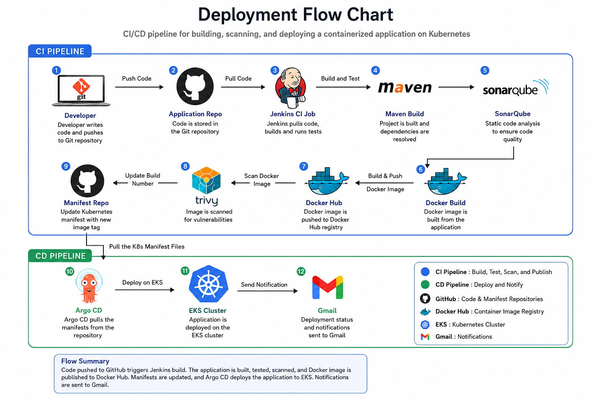

# 🚀 DevOps Project with Jenkins, Maven, SonarQube, Docker, EKS & ArgoCD

A complete end-to-end DevOps implementation demonstrating Continuous Integration, Continuous Delivery, Code Quality Analysis, Containerization, Kubernetes Orchestration, and GitOps deployment practices using industry-standard tools.

## 📌 Project Overview

This project showcases a modern DevOps pipeline that automates the complete software delivery lifecycle:

* Source Code Management with Git & GitHub
* Continuous Integration using Jenkins
* Build Automation using Maven
* Static Code Analysis using SonarQube
* Containerization using Docker
* Container Registry Integration
* Kubernetes Cluster Provisioning using EKS
* GitOps Deployment using ArgoCD
* Infrastructure Automation on AWS

---

## 🏗️ Architecture



### Architecture Flow

1. Developer pushes code to GitHub.
2. Jenkins Pipeline gets triggered.
3. Maven builds the application.
4. SonarQube performs code quality checks.
5. Docker image is built and pushed to Docker Registry.
6. ArgoCD monitors Kubernetes manifests repository.
7. ArgoCD syncs changes to AWS EKS cluster.
8. Application gets deployed automatically.

---

## 🛠️ Technology Stack

| Category                | Tools            |
| ----------------------- | ---------------- |
| CI/CD                   | Jenkins          |
| Build Tool              | Maven            |
| Code Quality            | SonarQube        |
| Containerization        | Docker           |
| Cloud Platform          | AWS              |
| Container Orchestration | Kubernetes (EKS) |
| GitOps                  | ArgoCD           |
| Database                | PostgreSQL       |
| SCM                     | GitHub           |
| Operating System        | Ubuntu Linux     |

---

# 📋 Prerequisites

Before starting, ensure you have:

* AWS Account
* Ubuntu EC2 Instances
* GitHub Repository
* DockerHub Account
* IAM User with EKS Permissions
* Java 17 Installed
* Internet Connectivity

---

# ⚙️ Jenkins Setup

## Install Java

```bash
sudo apt update
sudo apt upgrade
sudo apt install openjdk-17-jre
java -version
```

## Install Jenkins

Official Documentation:

https://www.jenkins.io/doc/book/installing/linux/

```bash
curl -fsSL https://pkg.jenkins.io/debian/jenkins.io-2023.key | sudo tee \
/usr/share/keyrings/jenkins-keyring.asc > /dev/null

echo deb [signed-by=/usr/share/keyrings/jenkins-keyring.asc] \
https://pkg.jenkins.io/debian binary/ | sudo tee \
/etc/apt/sources.list.d/jenkins.list > /dev/null

sudo apt-get update
sudo apt-get install jenkins
```

### Start Jenkins

```bash
sudo systemctl enable jenkins
sudo systemctl start jenkins
sudo systemctl status jenkins
```

### Configure SSH Access

```bash
sudo nano /etc/ssh/sshd_config
sudo service sshd reload

ssh-keygen
# OR
ssh-keygen -t ed25519
```

---

# 🔍 SonarQube Setup

## Update Packages

```bash
sudo apt update
sudo apt upgrade
```

## Install PostgreSQL

### Add PostgreSQL Repository

```bash
sudo sh -c 'echo "deb http://apt.postgresql.org/pub/repos/apt $(lsb_release -cs)-pgdg main" > /etc/apt/sources.list.d/pgdg.list'

wget -qO- https://www.postgresql.org/media/keys/ACCC4CF8.asc \
| sudo tee /etc/apt/trusted.gpg.d/pgdg.asc &>/dev/null
```

### Install PostgreSQL

```bash
sudo apt update
sudo apt-get -y install postgresql postgresql-contrib
sudo systemctl enable postgresql
```

### Create SonarQube Database

```bash
sudo passwd postgres
su - postgres

createuser sonar
psql

ALTER USER sonar WITH ENCRYPTED password 'sonar';
CREATE DATABASE sonarqube OWNER sonar;
GRANT ALL PRIVILEGES ON DATABASE sonarqube TO sonar;

\q
exit
```

---

## Install Java 17 (Temurin)

```bash
wget -O - https://packages.adoptium.net/artifactory/api/gpg/key/public \
| sudo tee /etc/apt/keyrings/adoptium.asc

echo "deb [signed-by=/etc/apt/keyrings/adoptium.asc] \
https://packages.adoptium.net/artifactory/deb \
$(awk -F= '/^VERSION_CODENAME/{print$2}' /etc/os-release) main" \
| sudo tee /etc/apt/sources.list.d/adoptium.list

sudo apt update
sudo apt install temurin-17-jdk
```

---

## Linux Kernel Tuning

### Increase File Limits

```bash
sudo vim /etc/security/limits.conf
```

Add:

```text
sonarqube - nofile 65536
sonarqube - nproc 4096
```

### Increase Memory Mapping

```bash
sudo vim /etc/sysctl.conf
```

Add:

```text
vm.max_map_count=262144
```

Apply:

```bash
sudo sysctl -p
```

---

## Install SonarQube

```bash
wget https://binaries.sonarsource.com/Distribution/sonarqube/sonarqube-9.9.0.65466.zip

sudo apt install unzip
sudo unzip sonarqube-9.9.0.65466.zip -d /opt

sudo mv /opt/sonarqube-9.9.0.65466 /opt/sonarqube
```

### Create Sonar User

```bash
sudo groupadd sonar

sudo useradd \
-c "user to run SonarQube" \
-d /opt/sonarqube \
-g sonar sonar

sudo chown sonar:sonar /opt/sonarqube -R
```

### Configure Database Connection

Edit:

```bash
sudo vim /opt/sonarqube/conf/sonar.properties
```

```properties
sonar.jdbc.username=sonar
sonar.jdbc.password=sonar
sonar.jdbc.url=jdbc:postgresql://localhost:5432/sonarqube
```

---

## Configure SonarQube Service

Create:

```bash
sudo vim /etc/systemd/system/sonar.service
```

```ini
[Unit]
Description=SonarQube Service
After=syslog.target network.target

[Service]
Type=forking

ExecStart=/opt/sonarqube/bin/linux-x86-64/sonar.sh start
ExecStop=/opt/sonarqube/bin/linux-x86-64/sonar.sh stop

User=sonar
Group=sonar

Restart=always

LimitNOFILE=65536
LimitNPROC=4096

[Install]
WantedBy=multi-user.target
```

### Start SonarQube

```bash
sudo systemctl daemon-reload
sudo systemctl start sonar
sudo systemctl enable sonar
sudo systemctl status sonar
```

### Monitor Logs

```bash
sudo tail -f /opt/sonarqube/logs/sonar.log
```

---

# ☁️ AWS EKS Setup

## Install AWS CLI

```bash
curl "https://awscli.amazonaws.com/awscli-exe-linux-x86_64.zip" \
-o "awscliv2.zip"

unzip awscliv2.zip

sudo ./aws/install

aws --version
```

---

## Install kubectl

```bash
curl -O https://s3.us-west-2.amazonaws.com/amazon-eks/1.27.1/2023-04-19/bin/linux/amd64/kubectl

chmod +x kubectl

sudo mv kubectl /bin

kubectl version --output=yaml
```

---

## Install eksctl

```bash
curl --silent --location \
"https://github.com/weaveworks/eksctl/releases/latest/download/eksctl_$(uname -s)_amd64.tar.gz" \
| tar xz -C /tmp

sudo mv /tmp/eksctl /bin

eksctl version
```

---

## Create EKS Cluster

```bash
eksctl create cluster \
--name virtualtechbox-cluster \
--region ap-south-1 \
--node-type t2.small \
--nodes 3
```

Verify:

```bash
kubectl get nodes
```

---

# 🚀 ArgoCD Installation

## Create Namespace

```bash
kubectl create namespace argocd
```

## Install ArgoCD

```bash
kubectl apply \
-n argocd \
-f https://raw.githubusercontent.com/argoproj/argo-cd/stable/manifests/install.yaml
```

Check Pods:

```bash
kubectl get pods -n argocd
```

---

## Install ArgoCD CLI

```bash
curl --silent --location \
-o /usr/local/bin/argocd \
https://github.com/argoproj/argo-cd/releases/download/v2.4.7/argocd-linux-amd64

chmod +x /usr/local/bin/argocd
```

---

## Expose ArgoCD UI

```bash
kubectl patch svc argocd-server \
-n argocd \
-p '{"spec":{"type":"LoadBalancer"}}'
```

Check Service:

```bash
kubectl get svc -n argocd
```

---

## Get Admin Password

```bash
kubectl get secret \
argocd-initial-admin-secret \
-n argocd -o yaml
```

Decode:

```bash
echo <BASE64_PASSWORD> | base64 --decode
```

---

# 🔗 Add EKS Cluster to ArgoCD

### Login

```bash
argocd login <ARGOCD-LOADBALANCER-DNS> \
--username admin
```

### Verify Cluster

```bash
argocd cluster list

kubectl config get-contexts
```

### Register Cluster

```bash
argocd cluster add \
<CLUSTER_CONTEXT_NAME> \
--name virtualtechbox-eks-cluster
```

---

# 🧹 Cleanup Resources

Delete Application:

```bash
kubectl delete deployment.apps/<deployment-name>

kubectl delete service/<service-name>
```

Delete EKS Cluster:

```bash
eksctl delete cluster \
--region ap-south-1 \
--name virtualtechbox-cluster
```

---

# 📹 Reference Video

https://youtu.be/e42hIYkvxoQ

---

# 🤝 Contributing

Contributions are welcome!

1. Fork the repository.
2. Create a feature branch.
3. Commit your changes.
4. Push the branch.
5. Open a Pull Request.

---

# ⭐ Support

If this project helped you learn DevOps, consider giving it a ⭐ on GitHub.

---

